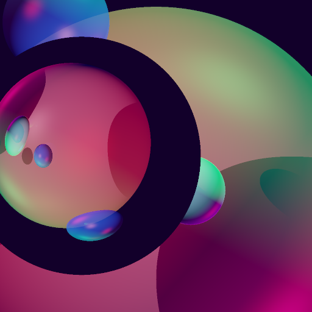

# Programmiersprachen: Raytracer

## dependencies
```
cmake
xorg-dev
libglu1-mesa-dev
freeglut3-dev
libxi-dev
libxrandr-dev
```

## building
```
mkdir build
cmake ..
make
```

## running

Executables will be in `build/source`.  Run the ray tracer from the
`build/source` directory with one of the provided scenes:

```sh
$ ./raytracer ../../source/tests/simple3.sdf
[Info][SDF] Parsed 25 lines.
Rendering scene to 'image.ppm'...
```


## SDF (Scene Description Format)

```bash
# material
#                 name Kar Kag Kab Kdr Kdg Kdb Ksr Ksg Ksb   m reflectivity opacity refractive idx
define material purple 0.7 0.3 1.0 0.7 0.3 1.0 0.7 0.3 1.0  20          0.5       1              1

# geometry
#                     name   center  r material
define shape sphere martin 0 0 -100 50   purple
#                name         min      max material
define shape box olaf -10 -10 -10 10 10 10   purple

# light
#                   name      position   r   g   b brightness
define light another_sun 800 1500 -100 1.0 0.5 0.5          2
#         r   g   b
ambient 0.1 0.0 0.1

# camera
#             name  fov    position    direction          up
define camera  eye 45.0 0.0 0.0 0.0 0.0 0.0 -1.0 0.0 1.0 0.0

# render command
#      camera        file resolution subpixels
render    eye simple3.ppm    900 600         1
```


